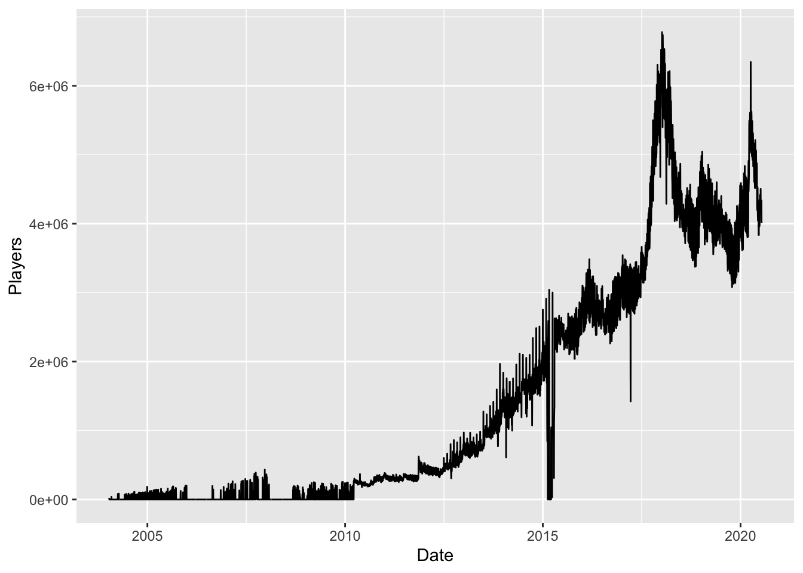

# Preprocessing


## Read data

Read data from app-specific files


```r
paths <- list.files("data-raw/Top 500 Games July 2020/", full.names = TRUE)
COLS <- cols_only(
    DateTime = "T", 
    Players = "d" 
    )
dat <- tibble(appid = paths) %>% 
  mutate(data = map(appid, ~read_csv(., col_types = COLS))) %>% 
  mutate(appid = str_remove(basename(paths), ".csv")) %>% 
  unnest(data)
names(dat) <- c("appid", "Date", "Players")
dat$Date <- as.Date(dat$Date)
```

## Dates

Not all games have existed since the dawn of time. 

There appear to be some data quality issues in early 2015.


```r
dat %>% 
  group_by(Date) %>% 
  summarise(Players = sum(Players, na.rm = TRUE)) %>% 
  ggplot(aes(Date, Players)) +
  geom_line()
```

```
## `summarise()` ungrouping output (override with `.groups` argument)
```




```r
dat %>% 
  mutate(year = year(Date)) %>% 
  group_by(year) %>% 
  summarise(prop_missing = sum(is.na(Players))/n())
```

```
## `summarise()` ungrouping output (override with `.groups` argument)
```

```
## # A tibble: 17 x 2
##     year prop_missing
##    <dbl>        <dbl>
##  1  2004       0.781 
##  2  2005       0.751 
##  3  2006       0.978 
##  4  2007       0.817 
##  5  2008       0.753 
##  6  2009       0.821 
##  7  2010       0.305 
##  8  2011       0.246 
##  9  2012       0.307 
## 10  2013       0.424 
## 11  2014       0.546 
## 12  2015       0.234 
## 13  2016       0.0391
## 14  2017       0.0388
## 15  2018       0.0632
## 16  2019       0.0114
## 17  2020       0
```

We only really need 2019 and 2020


```r
dat <- dat %>% 
  filter(Date >= as.Date("2019-01-01"))
```

## Coding

Process the hand coded categories


```r
titles <- read_excel(
  "data-raw/500 Steam Games Coding FINAL.xlsx",
  col_types = "text"
  )
names(titles) <- c("appid", "Name", "LB", "MP", "COOP")
table(titles$LB)
```

```
## 
##  N0  NN  Y0  YY 
##   2 404   1  93
```

```r
titles$LB <- ifelse(titles$LB == "N0", "NN", titles$LB)
titles$LB <- ifelse(titles$LB == "Y0", "YY", titles$LB)
table(titles$MP)
```

```
## 
##  NN  YY 
## 155 345
```

```r
table(titles$COOP)
```

```
## 
##  NN  YY 
## 188 312
```

```r
titles <- titles %>% 
  mutate(across(LB:COOP, ~factor(ifelse(.=="NN", "No", "Yes"))))
```

Look at counts of categories


```r
dat <- left_join(titles, dat)
```

```
## Joining, by = "appid"
```

```r
dat %>% 
  group_by(LB) %>% 
  summarise(
    Games = length(unique(appid)), 
    Players = scales::comma(sum(Players, na.rm = TRUE))
    )
```

```
## `summarise()` ungrouping output (override with `.groups` argument)
```

```
## # A tibble: 2 x 3
##   LB    Games Players      
##   <fct> <int> <chr>        
## 1 No      406 824,625,371  
## 2 Yes      94 1,482,975,138
```

```r
dat %>% 
  group_by(MP) %>% 
  summarise(
    Games = length(unique(appid)), 
    Players = scales::comma(sum(Players, na.rm = TRUE))
    )
```

```
## `summarise()` ungrouping output (override with `.groups` argument)
```

```
## # A tibble: 2 x 3
##   MP    Games Players      
##   <fct> <int> <chr>        
## 1 No      155 182,228,172  
## 2 Yes     345 2,125,372,337
```

```r
dat %>% 
  group_by(COOP) %>% 
  summarise(
    Games = length(unique(appid)), 
    Players = scales::comma(sum(Players, na.rm = TRUE))
    )
```

```
## `summarise()` ungrouping output (override with `.groups` argument)
```

```
## # A tibble: 2 x 3
##   COOP  Games Players      
##   <fct> <int> <chr>        
## 1 No      188 236,904,529  
## 2 Yes     312 2,070,695,980
```


## Save


```r
# Save data to disk
dir.create("data", showWarnings = FALSE)
saveRDS(dat, "data/players.rds")
saveRDS(titles, "data/titles.rds")
```
